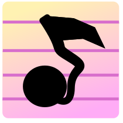

# LayerTune 

    

LayerTune is a game that turns music education into a game.

The goal of the game is to mimic a predetermined music with the tools that we give you, such as:

 - The note
 - The tempo

The game consist of 6 levels, each level is made up of 1 or 2 instruments. Listen to the predetermined music of a level, and then, start building the music you just heard using the **note** & **tempo** for each instrument. Once you're confident that you perfectly mimiced the original music, click "finish" and witness your results !

## Technologies used

To make this game we used the game engine Godot  (free **&** open-source 🙂), and its language **GDScript**.

## Context

LayerTune  is made by Kayyissa Haïssous and Théo Thénault.

This game was made during a course focused on *Sound* given to us at the CNAM-ENJMIN. During this course we had 3 day (of 7 hours) to make an application / game that focused around sound.

## Building

The game builds under Godot 4.3 and should build under future versions.
